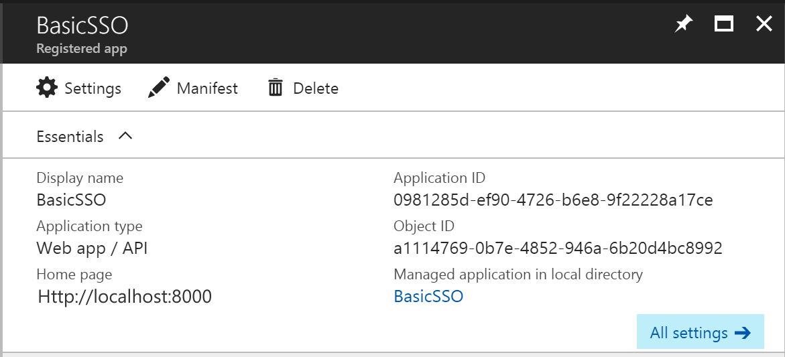

# Basic SSO - Python version

In this sample we show you how to integrate Azure Active Directory(Azure AD) to provide secure sign in and authorization. 

The code in the following sections is part of the full featured Python app and presented as a new project for clarity and separation of functionality.

**Table of contents**
* [Register the application in Azure Active Directory](#register-the-application-in-azure-active-directory)
* [Build and debug locally](#build-and-debug-locally)


## Build and deploy the Starter Project

Visual Studio Code is used as editor.

The starter project is a simple application with only SQL authentication configured.  By updating this project, you can see how to integrate O365 Single Sign On to an application with existing authentication.

1. Open Visual Studio Code as administrator, open the project under **Starter Project** folder. The starter project you can register a new user, login and then display a basic page with login user info.

2. Open a command port and then locate to the same directory as `manage.py`. Run the command below.

   ```
   Python manage.py runserver
   ```

3. Open the browser and input http://localhost:8000. Click the Register link to register as a user.

   

4. Complete the form to add a user.

   

5. Once registered, you should see a blank page.

   


## Register the application in Azure Active Directory

1. Sign in to the Azure portal: [https://portal.azure.com/](https://portal.azure.com/).

2. Choose your Azure AD tenant by selecting your account in the top right corner of the page.

3. Click **Azure Active Directory** -> **App registrations** -> **+Add**.

   

4. Input a **Name**, and select **Web app / API** as **Application Type**.

   Input **Sign-on URL**: http://localhost:8000

   

   Click **Create**.

   Notice: Sign-on URL should match your local dev environment URL.

5. Once completed, the app will show in the list.

   

6. Click it to view its details. 

   

7. Click **All settings**, if the setting window did not show.

     

     Copy aside **Application ID**, then Click **Save**.

     Click **Reply URLs**, add the following URL into it. 

     [https://localhost:8000/Auth/O365/Callback](https://localhost:8000/Auth/O365/Callback)

   * Click **Required permissions**. Add the following permissions:

     | API                            | Application Permissions | Delegated Permissions         |
     | ------------------------------ | ----------------------- | ----------------------------- |
     | Windows Azure Active Directory |                         | Sign in and read user profile |

     

   * Click **Keys**, then add a new key

     

     Click **Save**, then copy aside the **VALUE** of the key. 

   Close the Settings window.


## Add Single Sign On

1. Open the Starter Project in Visual Studio Code, if it isn't already open.  

2. Create a new file named **env.bat** in the same directory as **manage.py**. Add two new keys **ClientId** and **ClientSecret**. These keys will be used to identity in your apps with Windows Azure Active Directory.

   ```xml
   set ClientId=<input your client id here>
   set ClientSecret=<input your client secret here>
   ```

   

   **ClientId**: use the Client Id of the app registration you created earlier.

   **ClientSecret**: use the Key value of the app registration you created earlier.

3. Create a new file named **constant.py** in the same directory as **manage.py**, remove all generated code and paste the following.  

   ```python
   import os

   client_id = os.environ['ClientId']

   client_secret = os.environ['ClientSecret']

   authority = 'https://login.microsoftonline.com/common/'

   login_base_uri = 'https://login.microsoftonline.com/common/oauth2/authorize?'

   log_out_url = 'https://login.microsoftonline.com/common/oauth2/logout?redirect_uri=%s&post_logout_redirect_uri=%s'

   microsoft_certs_uri = 'https://login.microsoftonline.com/common/discovery/v2.0/keys'

   company_admin_role_name = "Company Administrator"
   


   o365_username_cookie = "O365CookieUsername"

   o365_email_cookie = "O365CookieEmail"

   o365_user_session_key = '_o365_user'

   favorite_colors = [
       {'value':'#2F19FF', 'name':'Blue'}, 
       {'value':'#127605', 'name':'Green'}, 
       {'value':'#535353', 'name':'Grey'}
   ]


   class Resources():
       AADGraph = "https://graph.windows.net/"
       MSGraph = "https://graph.microsoft.com/"
       MSGraph_VERSION  ='beta'

   class Roles():
       Admin = "Admin"
       Faculty = "Teacher"
       Student = "Student"

   class O365ProductLicenses():
       #Microsoft Classroom Preview
       Classroom = "80f12768-d8d9-4e93-99a8-fa2464374d34"
       #Office 365 Education for faculty
       Faculty = "94763226-9b3c-4e75-a931-5c89701abe66"
       #Office 365 Education for students
       Student = "314c4481-f395-4525-be8b-2ec4bb1e9d91"
       #Office 365 Education for faculty
       FacultyPro = "78e66a63-337a-4a9a-8959-41c6654dfb56"
       #Office 365 Education for students
       StudentPro = "e82ae690-a2d5-4d76-8d30-7c6e01e6022e"
   ```

   ​

   This file defines constant parameters that will be used for O365 authentication.

   To see how this file works in the Demo app, refer to the file located [here](../constant.py) in the Demo app.

4. Edit **account\templates\account\login.html**, remove all code and paste the following.  

   ```html
   
   
    *   * Copyright (c) Microsoft Corporation. All rights reserved. Licensed under the MIT license.  
    *   * See LICENSE in the project root for license information.  
     

   Log in

   
       <link rel="stylesheet" href="/static/css/login.css">
   

   
   <div class="loginbody">
   	<div class="row">
           <div class="col-md-5">
               <section id="loginForm">
   				<form class="form-horizontal" action="/Account/Login" method="post" role="form">
               	<h4 class="margin-btm-20">Use your local account to log in</h4>
               		<div class="form-group">
   						
   						<div class="validation-summary-errors text-danger">
   							<ul>
   								
   								<li>{{ error }}</li>
   								
   							</ul>
   						</div>
   						
                   		<div class="col-md-12">
   							{{ user_form.Email }}
                       		<span class="field-validation-valid text-danger" data-valmsg-for="Email" data-valmsg-replace="true"></span>
                   		</div>
               		</div>
               		<div class="form-group">
                   		<div class="col-md-12">
   							{{ user_form.Password }}
   							<span class="field-validation-valid text-danger" data-valmsg-for="Password" data-valmsg-replace="true"></span>
                   		</div>
               		</div>
               		<div class="form-group">
                   		<div class="margin-left-20 col-md-10">
                       		<div class="checkbox">	
   								{{ user_form.RememberMe }}		
   								<label for="RememberMe">Remember me?</label>
                       		</div>
                   		</div>
               		</div>
               		<div class="form-group">
   						<div class=" col-md-10">
                       		<input type="submit" value="Sign in" class="btn btn-default btn-local-login" />
   						</div>
   					</div>
   					<p>
   						<a href="/Account/Register" class="registerlink">Register as a new user</a>
   					</p>
   			</form>
   			</section>
           </div>
           <div class="col-md-5">
               <section id="socialLoginForm">
   			<h4 class="margin-btm-20">Use your school account</h4>
   			<form action="/Account/O365Login" method="post">
   				<div id="socialLoginList">
   					<p>
   						<button type="submit" class="btn btn-default btn-ms-login" id="OpenIdConnect" name="provider" value="OpenIdConnect" title="Log in using your Microsoft Work or school account"></button>
   					</p>
   				</div>
   			</form>
               </section>
           </div>
       </div>
   </div>
   

   
   <script src="/static/js/jquery.validate.js"></script>
   <script src="/static/js/jquery.validate.min.js"></script>
   <script src="/static/js/jquery.validate-vsdoc.js"></script>
   <script src="/static/js/jquery.validate.unobtrusive.js"></script>
   
   ```

   A new login to O365 button is added on this page. When login to O365 is clicked, it will redirect the page to O365 login page.

   To see how this file works in the Demo app, refer to the file located [here](../account/templates/account/login.html) in the Demo app.

5. Edit **app\urls.py**. Update the **urlpatterns** array as below.

   ```python
   urlpatterns = [
       url(r'^$', account_views.index, name='index'),
       url(r'^Account/Login', account_views.login, name='login'), 
       url(r'^Account/Register', account_views.register, name='register'),
       url(r'^Account/LogOff', account_views.logoff, name='logoff'),
       url(r'^Account/O365Login', account_views.o365_login, name='o365_login'),
       url(r'^Auth/O365/Callback', account_views.o365_auth_callback, name='o365_auth_callback'),
       url(r'^Schools$', schools_views.schools, name='schools'),
   ]
   ```

   Two new routers are added for O365 login and login callback. 

   To see how this file works in the Demo app, refer to the file located [here](../app/urls.py) in the Demo app.

6. Create a new file **token_service.py** in **services** folder, remove all code and paste the following.  

   ```python

   import adal
   import datetime, time
   import constant
   from models.db import TokenCache

   class RefreshTokenException(Exception):
       pass

   class TokenService(object):
       '''
       This class is responsible for cache and retrieve tokens to and from the backend database.
       In this sample, tokens are cached in clear text in database. For real projects, they should be encrypted.
       '''
       def __init__(self):
           pass

       def get_token_with_code(self, code, redirect_uri, resource):
           auth_context = adal.AuthenticationContext(constant.authority)
           result = auth_context.acquire_token_with_authorization_code(code, redirect_uri, resource, constant.client_id, constant.client_secret)
           return result

       def get_access_token(self, resource, o365_user_id):
           '''
           Get access token.
           If the cached token is exipred, a new refresh token will be got with the refresh token, cached and returned to the invoker.
           If there is no refresh token or the refresh token is expired, RefreshTokenException will be raised.
           '''
           token_cache = TokenCache.objects.filter(o365UserId=o365_user_id, resource=resource).first()
           if token_cache and self._is_valid(token_cache.expiresOn):
               return token_cache.accessToken

           auth_result = self._refresh_token(resource, o365_user_id)
           self._create_or_update_token(auth_result, o365_user_id)
           return auth_result.get('accessToken')

       def cache_tokens(self, auth_result, o365_user_id):
           '''
           Cache access token and refresh token.
           '''
           self._create_or_update_token(auth_result, o365_user_id)
           return auth_result.get('accessToken')

       def clear_token_cache(self):
            TokenCache.objects.all().delete()

       def _is_valid(self, expires_on):
           now = datetime.datetime.now(expires_on.tzinfo)
           return now < expires_on - datetime.timedelta(minutes=5)

       def _refresh_token(self, resource, o365_user_id):
           cache = TokenCache.objects.filter(o365UserId=o365_user_id).order_by('-expiresOn').first()
           if cache is None:
               raise RefreshTokenException('cache is None')
           try:
               auth_context = adal.AuthenticationContext(constant.authority)
               auth_result = auth_context.acquire_token_with_refresh_token(cache.refreshToken, constant.client_id, resource, constant.client_secret)
           except:
               raise RefreshTokenException('refresh is Error')
           return auth_result

       def _create_or_update_token(self, auth_result, o365UserId):
           resource = auth_result.get('resource')
           expiresOnLocal = datetime.datetime.strptime(auth_result.get('expiresOn'), "%Y-%m-%d %H:%M:%S.%f")  
           expiresOnUTC = (expiresOnLocal + datetime.timedelta(seconds=time.timezone)).replace(tzinfo=datetime.timezone.utc)
           token = TokenCache.objects.get_or_create(o365UserId=o365UserId, resource=resource)[0]
           token.accessToken = auth_result.get('accessToken')
           token.refreshToken = auth_result.get('refreshToken')
           token.expiresOn = expiresOnUTC
           token.save()
   ```


   This class is responsible for cache and retrieve tokens to and from the backend database.

   In this sample, tokens are cached in clear text in database. For real projects, they should be encrypted.

   To see how this file works in the Demo app, refer to the file located [here](../services/token_service.py) in the Demo app.

7. Create a new file **rest_api_service.py** in **services** folder, remove all code and paste the following.

   ```python

   import re
   import json
   import requests
   import constant

   class HttpRequestFailed(Exception):
       def __init__(self, request, response):
           self._request = request
           self._response = response

       @property
       def response(self):
           return self._request

       @property
       def response(self):
           return self._response

   class RestApiService(object):

       def get_raw(self, url, token, headers=None):
           method = 'GET'
           s_headers = {}
           self._set_header_token(s_headers, token)
           if headers:
               s_headers.update(headers)
           response = self._send(method, url, s_headers)
           return response.text

       def get_json(self, url, token, headers=None):
           method = 'GET'
           s_headers = {'Accept': 'application/json',
                        'Content-Type': 'application/json'}
           self._set_header_token(s_headers, token)
           if headers:
               s_headers.update(headers)
           response = self._send(method, url, s_headers)
           return json.loads(response.text)

       def get_img(self, url, token, headers=None):
           method = 'GET'
           s_headers = {'content-type': 'image/jpeg'}
           self._set_header_token(s_headers, token)
           if headers:
               s_headers.update(headers)
           response = self._send(method, url, s_headers)
           return response.content

       def get_object_list(self, url, token, key='value', headers=None, model=None, next_key=''):
           content = self.get_json(url, token, headers)
           entity_list = []
           next_link = ''
           if content and model:
               value_list = content[key]
               for value in value_list:
                   entity = model(value)
                   entity_list.append(entity)
               if next_key:
                   next_link = content.get(next_key, '')
           if next_key:
               return entity_list, next_link
           else:
               return entity_list

       def get_object(self, url, token, headers=None, model=None):
           content = self.get_raw(url, token, headers)
           if content and model:
               value = json.loads(content)
               return model(value)
           return None

       def delete(self, url, token, headers=None):
           method = 'DELETE'
           s_headers = {'Accept': 'application/json',
                        'Content-Type': 'application/json'}
           self._set_header_token(s_headers, token)
           if headers:
               s_headers.update(headers)
           self._send(method, url, s_headers)

       def post_json(self, url, token, headers=None, data=None):
           method = 'POST'
           s_headers = {'Accept': 'application/json',
                        'Content-Type': 'application/json'}
           self._set_header_token(s_headers, token)
           if headers:
               s_headers.update(headers)
           response = self._send(method, url, s_headers, json.dumps(data))

       def _set_header_token(self, headers, token):
           key = 'Authorization'
           value = 'Bearer {0}'.format(token)
           headers[key] = value

       def _send(self, method, url, headers, data=None):
           session = requests.Session()
           request = requests.Request(method, url, headers, data=data)
           prepped = request.prepare()
           response = session.send(prepped)
           if response.status_code < 200 or response.status_code > 299:
               raise HttpRequestFailed(request, response)
           return response
   ```

   This class is responsible for REST API request and handle result. 

   To see how this file works in the Demo app, refer to the file located [here](../services/rest_api_service.py) in the Demo app.

8.   Create a new file **ms_graph_service.py** in **services** folder, remove all code and paste the following.

   ```python


	import msgraph
	import constant
	from utils.auth_provider import AuthProvider
	from services.rest_api_service import RestApiService
	from models.auth import O365User
	from models.education import Document, Conversation

	class MSGraphService(object):

    def __init__(self, access_token):
        self.access_token = access_token
        self.api_base_uri = constant.Resources.MSGraph + 'v1.0' + '/'
        self.rest_api_service = RestApiService()

        auth_provider = AuthProvider()
        auth_provider.access_token(self.access_token)
        self.ms_graph_client = msgraph.GraphServiceClient(self.api_base_uri, auth_provider, msgraph.HttpProvider())

    def get_o365_user(self, tenant_id):
        
        me = self._get_me().to_dict()
        org = self._get_organization(tenant_id)
        
        id = me['id']
        first_name = me['givenName']
        last_name = me['surname']
        display_name = me['displayName']
        email = me['mail']
        if not email:
            email = me['userPrincipalName']
        tenant_name = org['displayName']
        roles = self._get_roles(id)
        photo = ''
        
        result  = O365User(id, email, first_name, last_name, display_name, tenant_id, tenant_name, roles, photo)
        
        return result

    def get_photo(self, object_id):
        url = self.api_base_uri + 'users/%s/photo/$value' % object_id
        try:
            return self.rest_api_service.get_img(url, self.access_token)
        except:
            return None

    def get_documents(self, object_id):
        url = self.api_base_uri + 'groups/%s/drive/root/children' % object_id
        return self.rest_api_service.get_object_list(url, self.access_token, model=Document)

    def get_documents_root(self, object_id):
        url = self.api_base_uri + 'groups/%s/drive/root' % object_id
        document = self.rest_api_service.get_object(url, self.access_token, model=Document)
        return document.web_url

    def get_conversations(self, object_id):
        url = self.api_base_uri + 'groups/%s/conversations' % object_id
        return self.rest_api_service.get_object_list(url, self.access_token, model=Conversation)
    
    def get_conversations_url(self, conversation_id, section_email):
        return 'https://outlook.office.com/owa/?path=/group/%s/mail&exsvurl=1&ispopout=0&ConvID=%s' % (section_email, conversation_id, )

    def get_conversations_root(self, section_email):
        return 'https://outlook.office.com/owa/?path=/group/%s/mail&exsvurl=1&ispopout=0' % section_email

    def _get_roles(self, user_id):
        roles = []
        return roles

    def _get_me(self):
        return self.ms_graph_client.me.get()

    def _get_assigned_licenses(self):
        url = self.api_base_uri + 'me/assignedLicenses'
        return self.rest_api_service.get_json(url, self.access_token)['value']

    def _get_organization(self, tenant_id):
        url = self.api_base_uri + 'organization/' + tenant_id
        return self.rest_api_service.get_json(url, self.access_token)


    def _get_directory_roles(self):
        expand_members = msgraph.options.QueryOption('$expand', 'members')
        return self.ms_graph_client.directory_roles.request(options=[expand_members]).get()
   ```

   This class is responsible for get user information from O365.

   To see how this file works in the Demo app, refer to the file located [here](../services/ms_graph_service.py) in the Demo app.

9. Edit **auth_service.py** in **services** folder, remove all code and paste the following.

   ```python

   import urllib
   import constant
   import uuid
   import jwt
   import requests
   from models.auth import O365User, UnifiedUser

   class AuthService(object):

       @staticmethod
       def get_redirect_uri(request, relative_redirect_uri):
           scheme = request.scheme
           host = request.get_host()
           return '%s://%s/%s' % (scheme, host, relative_redirect_uri)

       @staticmethod
       def get_authorization_url(request, response_type, relative_redirect_uri, state, extra_params = None):
           params  = {
               'client_id' : constant.client_id,
               'response_type': response_type,
               'response_mode': 'form_post',
               'redirect_uri': AuthService.get_redirect_uri(request, relative_redirect_uri),
               'state': state
               }
           if extra_params:
               params.update(extra_params)
           request.session['auth_state'] = state
           nonce = params.get('nonce')
           if nonce:
               request.session['auth_nonce'] = nonce
           return constant.login_base_uri + urllib.parse.urlencode(params).replace('%2B', '+')

       @staticmethod
       def get_random_string():
           return uuid.uuid4().hex

       @staticmethod
       def validate_state(request):
           if request.POST.get('state') != request.session.get('auth_state'):
               raise Exception('state does not match')

       @staticmethod
       def get_id_token(request):
           id_token = request.POST.get('id_token')
           return jwt.decode(id_token, verify=False)

       @staticmethod
       def get_current_user(request):
           return UnifiedUser(request)

       @staticmethod
       def set_o365_user(request, o365_user):
           request.session[constant.o365_user_session_key] = o365_user.to_json()

       @staticmethod
       def clear_o365_user(request):
           if constant.o365_user_session_key in request.session:
               del request.session[constant.o365_user_session_key]
   ```

   New methods are added to set or clear O365 user login information.

   To see how this file works in the Demo app, refer to the file located [here](../services/auth_service.py) in the Demo app.

10. Edit account\views.py, remove all code and paste the following.

  ```python
	import constant
	from utils.shortcuts import render

	from django.conf import settings
	from django.contrib.auth import login as auth_login
	from django.contrib.auth import logout as auth_logout
	from django.contrib.auth import authenticate as auth_authenticate
	from django.http import HttpResponse, HttpResponseRedirect

	from decorator import login_required
	from services.token_service import TokenService
	from services.ms_graph_service import MSGraphService
	from services.user_service import UserService
	from services.auth_service import AuthService
	from .forms import UserInfo, UserRegInfo

	user_service = UserService()
	token_service = TokenService()


	def index(request):
		user = AuthService.get_current_user(request)
		if not user.is_authenticated:
			return HttpResponseRedirect('/Account/Login')
		else:
			return HttpResponseRedirect('/Schools')

	def login(request):
		# get /Account/Login
		if request.method == 'GET':
		   user_form = UserInfo()
		   return render(request, 'account/login.html', { 'user_form': user_form })   
		# post /Account/Login
		else:        
			return login_post(request)
        
	def login_post(request):
		email = ''
		password = ''
		errors = []
		user_form = UserInfo(request.POST)
		if user_form.is_valid():
			data = user_form.clean()
			email = data['Email']
			password = data['Password']
			rememberme = data['RememberMe']
			settings.SESSION_EXPIRE_AT_BROWSER_CLOSE = not rememberme
			user = auth_authenticate(username=email, password=password)
			if user is not None:
				auth_login(request, user)
				o365_user = user_service.get_o365_user(user)
				if o365_user:
					AuthService.set_o365_user(request, o365_user)
				return HttpResponseRedirect('/')
		errors.append('Invalid login attempt.')
		context = {
			'user_form': user_form,
			'errors': errors
		}
		return render(request, 'account/login.html', context)

	def o365_login(request):
		extra_params = {
			'scope': 'openid+profile',
			'nonce': AuthService.get_random_string()
		}
		o365_email = request.COOKIES.get(constant.o365_email_cookie)
		if o365_email:
			extra_params['login_hint'] = o365_email
		else:
			extra_params['prompt'] = 'login'
		o365_login_url = AuthService.get_authorization_url(request, 'code+id_token', 'Auth/O365/Callback', AuthService.get_random_string(), extra_params)
		settings.SESSION_EXPIRE_AT_BROWSER_CLOSE = True
		return HttpResponseRedirect(o365_login_url)


	def o365_auth_callback(request):
		
		AuthService.validate_state(request)
		code = request.POST.get('code')
		id_token = AuthService.get_id_token(request)
		
		o365_user_id = id_token.get('oid')
		tenant_id = id_token.get('tid')

		redirect_uri = AuthService.get_redirect_uri(request, 'Auth/O365/Callback')
		auth_result = token_service.get_token_with_code(code, redirect_uri, constant.Resources.MSGraph)
		token_service.cache_tokens(auth_result, o365_user_id)

		ms_graph_service = MSGraphService(auth_result.get('accessToken'))
		
		o365_user = ms_graph_service.get_o365_user(tenant_id)
		
		AuthService.set_o365_user(request, o365_user)

		local_user = user_service.get_user_by_o365_email(o365_user.email)
		if local_user:
			auth_login(request, local_user)

		response =  HttpResponseRedirect('/')
		response.set_cookie(constant.o365_username_cookie, o365_user.display_name)
		response.set_cookie(constant.o365_email_cookie, o365_user.email)
		return response


	def register(request):
		user_reg_form = UserRegInfo()
		# post /Account/Register
		if request.method == 'POST':
			errors = []
			user_reg_form = UserRegInfo(request.POST)
			if user_reg_form.is_valid():
				import pdb; pdb.set_trace()
				data = user_reg_form.clean()
				user = user_service.register(data['Email'], data['Password'],'')
				if user:
					auth_login(request, user)
					return HttpResponseRedirect('/')
				else:
					errors.append('Name %s is already taken.' % data['Email'])
					errors.append("Email '%s' is already taken." % data['Email'])
					return render(request, 'account/register.html', {'user_reg_form':user_reg_form, 'errors':errors})
		# get /Account/Register
		else:
			return render(request, 'account/register.html', {'user_reg_form':user_reg_form})

	@login_required
	def logoff(request):
		user = AuthService.get_current_user(request)
		AuthService.clear_o365_user(request)
		auth_logout(request)
		return HttpResponseRedirect('/')
    ​```
    
    Two new methods with name o365_login and o365_auth_callback are added. These methods are used for user login to O365 and then handle login result from O365.
    
    To see how this file works in the Demo app, refer to the file located [here](../account/views.py) in the Demo app.

11. Open command and then locate to the same directory as **manage.py**. Run below commands one by one. 

    `Python manage.py migrate`

    `env.bat`

    `Python manage.py runserver`

    Open the browser and then go to http://127.0.0.1:8000, the site is opened. After login with O365 account it will show a basic page.

    


**Copyright (c) 2017 Microsoft. All rights reserved.**