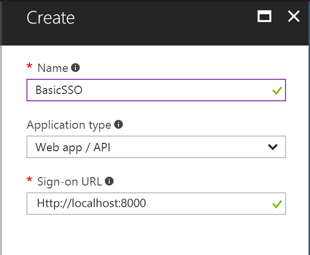
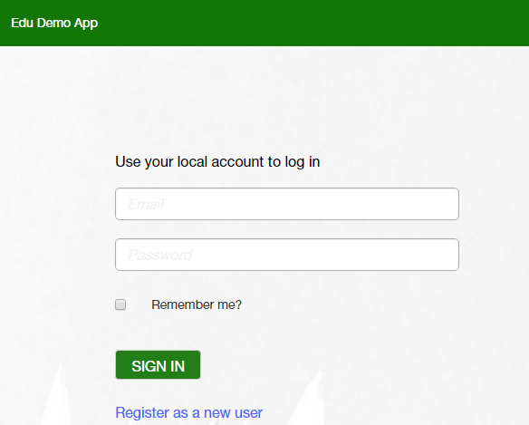

# Basic SSO - Python version

In this sample we show you how to integrate Azure Active Directory(Azure AD) to provide secure sign in and authorization. 

The code in the following sections is part of the full featured Python app and presented as a new project for clarity and separation of functionality.

**Table of contents**
* [Register the application in Azure Active Directory](#register-the-application-in-azure-active-directory)
* [Build and debug locally](#build-and-debug-locally)


## Register the application in Azure Active Directory

1. Sign in to the Azure portal: [https://portal.azure.com/](https://portal.azure.com/).

2. Choose your Azure AD tenant by selecting your account in the top right corner of the page.

3. Click **Azure Active Directory** -> **App registrations** -> **+Add**.

   

4. Input a **Name**, and select **Web app / API** as **Application Type**.

   Input **Sign-on URL**: https://localhost:44377/

   

   Click **Create**.

5. Once completed, the app will show in the list.

   

6. Click it to view its details. 

   

7. Click **All settings**, if the setting window did not show.

     

     Copy aside **Application ID**, then Click **Save**.

   * Click **Required permissions**. Add the following permissions:

     | API                            | Application Permissions | Delegated Permissions         |
     | ------------------------------ | ----------------------- | ----------------------------- |
     | Windows Azure Active Directory |                         | Sign in and read user profile |

     

   * Click **Keys**, then add a new key

     

     Click **Save**, then copy aside the **VALUE** of the key. 

   Close the Settings window.


## Build and debug locally

Make sure that Django can run on local machine. Otherwise following [this article](https://docs.djangoproject.com/en/1.11/topics/install/) to create a dev environment. 

 Visual Studio code is used as editor.


#### Create a new Django project.

1. Creating a project

   From the command line, `cd` into a directory where you’d like to store your code, then run the following command. You can rename **BasicSSO** to whatever that make sense.  

   `django-admin startproject BasicSSO `

2. Creating the account app

   To create your app, make sure you’re in the same directory as `manage.py` and type this command:

   `python manage.py startapp account`

#### Update source code

1. Open **BasicSSO** project with Visual Studio code. Create a file named **env.bat** in the same directory as `manage.py`. Add **CLIENT_ID** and **CLIENT_SECRET** to the file.
   - **CLIENT_ID**: use the Client Id of the app registration you created earlier.
   - **CLIENT_SECRET**: use the Key value of the app registration you created earlier.

     ​	  

2.  Create a new folder named **templates** under **account** folder, and then create a new folder named **account** under **templates** folder. Under new created account folder create two files named **index.html** and **helloworld.html**.

     ​	  

   Edit **index.html**,  delete all code and copy the following code to paste.
   ```python
    <!DOCTYPE html>
    <html>
    <head>
    	<meta charset="utf-8" />
        <meta name="viewport" content="width=device-width, initial-scale=1.0">    
    <style>
        #socialLoginList{width:100%;margin:auto;text-align: center;}
        #socialLoginList input{height: 50px;width: 200px;}
    </style>
    </head>
    <body>
        <form action="/Account/O365Login" method="post">
            
    				<div id="socialLoginList">
    					<p>
    						<button type="submit" class="btn btn-default btn-ms-login" id="OpenIdConnect" name="provider" value="OpenIdConnect" title="Log in using your Microsoft Work or school account">Sign in with Office 365</button>
    					</p>
    				</div>
    	</form>
    </body>
    </html>
   ```
   Edit **helloworld.html**, delete all code and copy the following code to paste.
   ```python
    <!DOCTYPE html>
    <html>
    <head>
    	<meta charset="utf-8" />
        <meta name="viewport" content="width=device-width, initial-scale=1.0">    
    <style>
        h1{width:100%;margin:auto;text-align: center;}
    </style>
    </head>
    <body>
       <h1> Hello world!</h1>
    </body>
    </html>
   ```
3. Open **/account/views.py**, delete all code and copy the following code to paste.


```python
from django.conf import settings
from django.contrib.auth import login as auth_login
from django.contrib.auth import logout as auth_logout
from django.contrib.auth import authenticate as auth_authenticate
from django.http import HttpResponse, HttpResponseRedirect
from django.template import RequestContext, loader


from services.auth_service import AuthService
# Create your views here.
def index(request):   
    template = loader.get_template('account/index.html') 
    return HttpResponse(template.render({}, request))


def o365_login(request):
    extra_params = {
        'scope': 'openid+profile',
        'nonce': AuthService.get_random_string(),
        'prompt':'login'
    }
    
    o365_login_url = AuthService.get_authorization_url(request, 'code+id_token', 'Auth/O365/Callback', AuthService.get_random_string(), extra_params)
    settings.SESSION_EXPIRE_AT_BROWSER_CLOSE = True
    return HttpResponseRedirect(o365_login_url)

def o365_auth_callback(request):
    
    AuthService.validate_state(request)
    code = request.POST.get('code')
    id_token = AuthService.get_id_token(request)

    #Succeed get userinfo from Azure.
    o365_user_id = id_token.get('oid')
    tenant_id = id_token.get('tid')
    

    template = loader.get_template('account/helloworld.html') 
    return HttpResponse(template.render({}))


def logoff(request):
    return HttpResponseRedirect('index')
```
4. Edit **Settings.py** under **/BasicSSO/BasicSSO** folder. Add **'account',** inside **INSTALLED_APPS**.

     ​	  

   In the same file, comment **'django.middleware.csrf.CsrfViewMiddleware',** inside **MIDDLEWARE**.

     ​	  

In the same file, edit **TEMPLATES** as below.


	TEMPLATES = [
	    {
	        'BACKEND': 'django.template.backends.django.DjangoTemplates',
	        'DIRS': [os.path.join(BASE_DIR,'templates')],
	        'APP_DIRS': True,
	        'OPTIONS': {
	            'context_processors': [
	                'django.template.context_processors.debug',
	                'django.template.context_processors.request',
	                'django.contrib.auth.context_processors.auth',
	                'django.contrib.messages.context_processors.messages',
	            ],
	        },
	    },
	]
5. Edit **urls.py** under **/BasicSSO/BasicSSO** folder. Delete all code and copy the following code to paste.

    ​
    ```python
    from django.conf.urls import url
    from django.contrib import admin
    from account import views as account_views

    urlpatterns = [   
        url(r'^admin/', admin.site.urls), 
        url(r'^$', account_views.index, name='index'),   
        url(r'^Account/O365Login', account_views.o365_login, name='o365_login'),   
        url(r'^Account/LogOff', account_views.logoff, name='logoff'),
        url(r'^Auth/O365/Callback', account_views.o365_auth_callback, name='o365_auth_callback'),
    ]

    ```
    ​
6. Create a new folder named **models** in the same directory as `manage.py`. Create a new file named **auth.py** under **models** folder. Edit **auth.py**, delete all code and copy the following code to paste.


```python
import json

import constant

class O365User(object):

    def __init__(self, id=None, email=None, first_name=None, last_name=None, display_name=None, tenant_id=None, tenant_name=None, roles=None, photo=None):

        self._id = id

        self._email = email

        self._first_name = first_name

        self._last_name = last_name

        self._display_name = display_name

        self._tenant_id = tenant_id

        self._tenant_name = tenant_name

        self._roles = roles

        self._photo = photo

    @property

    def id(self):

        return self._id

    @property

    def email(self):

        return self._email

    @property

    def first_name(self):

        return self._first_name

    @property

    def last_name(self):

        return self._last_name

    @property

    def display_name(self):

        return self._display_name

    @property

    def tenant_id(self):

        return self._tenant_id

    @property

    def tenant_name(self):

        return self._tenant_name

    @property

    def roles(self):

        return self._roles

    @property

    def photo(self):

        return self._photo

    def to_json(self):

        return json.dumps(self, default=lambda o: o.__dict__, sort_keys=True, indent=4)

    @staticmethod

    def from_json(value):

        obj = O365User()

        obj.__dict__.update(json.loads(value))

        return obj

class UnifiedUser(object):

    def __init__(self, request):

        self._request = request

        if constant.o365_user_session_key in self._request.session:

            user_json = self._request.session[constant.o365_user_session_key]

            self._o365_user = O365User.from_json(user_json)

        else:

            self._o365_user = None

    @property

    def is_authenticated(self):

        return self.o365_user is not None or self.local_user.is_authenticated

    @property

    def are_linked(self):

        return self.o365_user is not None and self.local_user.is_authenticated

    @property

    def is_admin(self):

        return self.o365_user is not None and constant.Roles.Admin in self.o365_user.roles

    @property

    def is_teacher(self):

        return self.o365_user is not None and constant.Roles.Faculty in self.o365_user.roles

    @property

    def is_student(self):

        return self.o365_user is not None and constant.Roles.Student in self.o365_user.roles

    @property

    def email(self):

        return self.local_user.email

    @property

    def o365_email(self):

        return self.o365_user.email

    @property

    def o365_user_id(self):

        return self.o365_user.id

    @property

    def user_id(self):

        return self.local_user.id

    @property

    def tenant_id(self):

        return self.o365_user.tenant_id

    @property

    def is_local(self):

        return self.o365_user is None

    @property

    def is_o365(self):

        return not self.local_user.is_authenticated

    @property

    def display_name(self):

        user = self.o365_user

        if not user and self.local_user.is_authenticated:

            user = self.local_user

        if user:

            if user.first_name and user.last_name:

                return "%s %s" % (user.first_name, user.last_name)

            else:

                return user.email

        return ''

    @property

    def main_role(self):

        if not self.o365_user:

            return None

        roles = self.o365_user.roles

        for role in [constant.Roles.Admin, constant.Roles.Faculty, constant.Roles.Student]:

            if role in roles:

                return role

        return None

    @property

    def photo(self):

        if not self.o365_user:

            return None

        return self.o365_user.photo

    @property

    def local_user(self):

        return self._request.user

    @property

    def o365_user(self):

        return self._o365_user
```


7. Create a new folder named **services** in the same directory as `manage.py`. Create a new file named **auth_service.py** under **services** folder. Edit **auth_service.py**, delete all code and copy the following code to paste.


```python
import urllib

import constant

import uuid

import jwt

import requests

from models.auth import O365User, UnifiedUser

class AuthService(object):

    @staticmethod

    def get_redirect_uri(request, relative_redirect_uri):

        scheme = request.scheme

        host = request.get_host()

        return '%s://%s/%s' % (scheme, host, relative_redirect_uri)

    @staticmethod

    def get_authorization_url(request, response_type, relative_redirect_uri, state, extra_params = None):

        params  = {

            'client_id' : constant.client_id,

            'response_type': response_type,

            'response_mode': 'form_post',

            'redirect_uri': AuthService.get_redirect_uri(request, relative_redirect_uri),

            'state': state

            }

        if extra_params:

            params.update(extra_params)

        request.session['auth_state'] = state

        nonce = params.get('nonce')

        if nonce:

            request.session['auth_nonce'] = nonce

        return constant.login_base_uri + urllib.parse.urlencode(params).replace('%2B', '+')

    @staticmethod

    def get_random_string():

        return uuid.uuid4().hex

    @staticmethod

    def validate_state(request):

        if request.POST.get('state') != request.session.get('auth_state'):

            raise Exception('state does not match')

    @staticmethod

    def get_id_token(request):

        id_token = request.POST.get('id_token')

        return jwt.decode(id_token, verify=False)

    @staticmethod

    def get_current_user(request):

        return UnifiedUser(request)

    @staticmethod

    def set_o365_user(request, o365_user):

        request.session[constant.o365_user_session_key] = o365_user.to_json()

    @staticmethod

    def clear_o365_user(request):

        if constant.o365_user_session_key in request.session:

            del request.session[constant.o365_user_session_key]
```


8. create a new file named **constant.py** in the same directory as `manage.py`. Edit it, delete all code and copy the following code to paste.

    ​


```python
import os

client_id = os.environ['ClientId']

client_secret = os.environ['ClientSecret']

source_code_repository_url = os.environ["SourceCodeRepositoryUrl"]


authority = 'https://login.microsoftonline.com/common/'

login_base_uri = 'https://login.microsoftonline.com/common/oauth2/authorize?'

log_out_url = 'https://login.microsoftonline.com/common/oauth2/logout?redirect_uri=%s&post_logout_redirect_uri=%s'

microsoft_certs_uri = 'https://login.microsoftonline.com/common/discovery/v2.0/keys'

company_admin_role_name = "Company Administrator"


o365_username_cookie = "O365CookieUsername"

o365_email_cookie = "O365CookieEmail"

o365_user_session_key = '_o365_user'


class Resources():
    AADGraph = "https://graph.windows.net/"
    MSGraph = "https://graph.microsoft.com/"
    MSGraph_VERSION  ='beta'
```


9. Open command and then locate to the same directory as `manage.py`. Run below commands one by one. 

`Python manage.py migrate`

`env.bat`

`Python manage.py runserver`

Open the browser and then go to http://127.0.0.1:8000, the site is opened. After login with O365 account it will show Hello world.


Copyright (c) 2017 Microsoft. All rights reserved.**