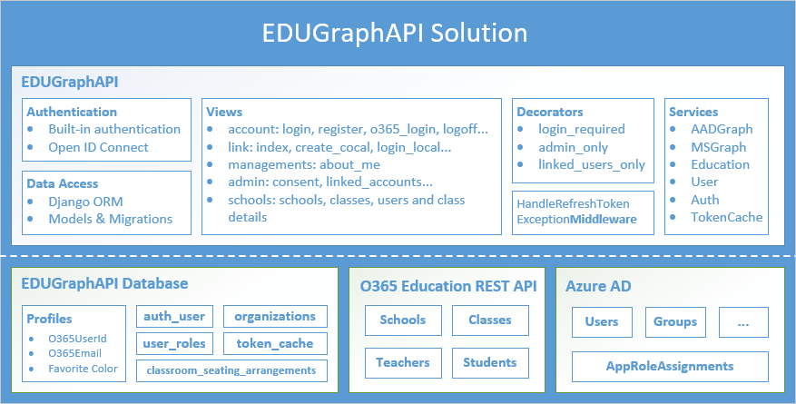

# EDUGraphAPI - Office 365 Education Code Sample

In this sample, we show you how to integrate with school roles/roster data as well as O365 services available via the Graph API. 

School data is kept in sync in O365 Education tenants by [Microsoft School Data Sync](http://sds.microsoft.com).  

**Table of contents**

- [Sample Goals](#sample-goals)
- [Prerequisites](#prerequisites)
- [Generate a self-signed certificate](#generate-a-self-signed-certificate)
- [Register the application in Azure Active Directory](#register-the-application-in-azure-active-directory)
- [Run the sample locally](#run-the-sample-locally)
- [Deploy the sample to Azure](#deploy-the-sample-to-azure)
- [Understand the code](#understand-the-code)
- [Questions and comments](#questions-and-comments)
- [Contributing](#contributing)

## Sample Goals

The sample demonstrates:

- Calling Graph APIs, including:

  - [Microsoft Azure Active Directory Graph API](https://www.nuget.org/packages/Microsoft.Azure.ActiveDirectory.GraphClient/)
  - [Microsoft Graph API](https://www.nuget.org/packages/Microsoft.Graph/)

- Linking locally-managed user accounts and Office 365 (Azure Active Directory) user accounts. 

  After linking accounts, users can use either local or Office 365 accounts to log into the sample website and use it.

- Getting schools, classes, teachers, and students from Office 365 Education:

  - [Office 365 Schools REST API reference](https://msdn.microsoft.com/office/office365/api/school-rest-operations)
  - A [Differential Query](https://msdn.microsoft.com/en-us/library/azure/ad/graph/howto/azure-ad-graph-api-differential-query) is used to sync data that is cached in a local database by the SyncData Web Job.

This sample is implemented with the Python language and [Django](https://www.djangoproject.com/) web framework.

> [Django](https://www.djangoproject.com/) is a high-level Python Web framework that encourages rapid development and clean, pragmatic design. Built by experienced developers, it takes care of much of the hassle of Web development, so you can focus on writing your app without needing to reinvent the wheel. It’s free and open source.

## Prerequisites

**Deploying and running this sample requires**:

- An Azure subscription with permissions to register a new application, and deploy the web app.

- An O365 Education tenant with Microsoft School Data Sync enabled

  - One of the following browsers: Edge, Internet Explorer 9, Safari 5.0.6, Firefox 5, Chrome 13, or a later version of one of these browsers.

  Additionally: Developing/running this sample locally requires the following:  

  - [Python](https://www.python.org/downloads/) 3.5.2 or above
  - [Django](https://www.djangoproject.com/download/) 1.11 or above
  - [MySQL](https://www.mysql.com)

## Generate a self-signed certificate

A self-signed certificate is required by the SyncData WebJob. For preview, you may skip the steps below and use the default certificate we provided:

* Certificate file: `/webjobs/sync_data/app_only_cert.pfx`
* Password: `J48W23RQeZv85vj`
* Key credential: `/webjobs/sync_data/key_credential.txt`

For production, you should you own certifcate:

1. Generate a certificate with PowerShell

   Run PowerShell **as administrator**, then execute the commands below:

   ```
   $cert = New-SelfSignedCertificate -Type Custom -KeyExportPolicy Exportable -KeySpec Signature -Subject "CN=Edu App-only Cert" -NotAfter (Get-Date).AddYears(20) -CertStoreLocation "cert:\CurrentUser\My" -KeyLength 2048
   ```

   > Note: please keep the PowerShell window open until you finish the steps below.

2. Get keyCredential

   Execute the commands below to get keyCredential:

   > Note: Feel free to change the file path at the end of the command.

   ```
   $keyCredential = @{}
   $keyCredential.customKeyIdentifier = [System.Convert]::ToBase64String($cert.GetCertHash())
   $keyCredential.keyId = [System.Guid]::NewGuid().ToString()
   $keyCredential.type = "AsymmetricX509Cert"
   $keyCredential.usage = "Verify"
   $keyCredential.value = [System.Convert]::ToBase64String($cert.GetRawCertData())
   $keyCredential | ConvertTo-Json > c:\keyCredential.txt
   ```

   The keyCredential is in the generated file, and will be used to create App Registrations in AAD.

   

3. Export the certificate

   ```
   $password = Read-Host -Prompt "Enter password" -AsSecureString
   Export-PfxCertificate -Cert $cert -Password $password -FilePath c:\app_only_cert.pfx
   ```

   

## Register the application in Azure Active Directory

1. Sign into the new Azure portal: [https://portal.azure.com/](https://portal.azure.com/).

2. Choose your Azure AD tenant by selecting your account in the top right corner of the page:

   

3. Click **Azure Active Directory** -> **App registrations** -> **+Add**.

   

4. Input a **Name**, and select **Web app / API** as **Application Type**.

   Input **Sign-on URL**: http://127.0.0.1:8000/

   

   Click **Create**.

   

5. Click **Settings**.

   - Click **Properties**, then set **Multi-tenanted** to **Yes**.

     

     Copy aside **Application ID**, then Click **Save**.

   - Click **Required permissions**. Add the following permissions:

     | API                            | Application Permissions       | Delegated Permissions                                        |
     | ------------------------------ | ----------------------------- | ------------------------------------------------------------ |
     | Microsoft Graph                | Read all users' full profiles | Read directory data<br>Access directory as the signed in user<br>Sign users in<br> Have full access to all files user can access<br> Have full access to user files<br> Read and write users' class assignments and their grades<br>Read users' view of the roster |
     | Windows Azure Active Directory |                               | Sign in and read user profile<br>Read and write directory data |

     

   - Click **Keys**, then add a new key:

     

     Click **Save**, then copy aside the **VALUE** of the key. 

   Close the Settings window.

6. Add keyCredential

   * Click **Manifest**.

     

   * Copy the keyCredential (all the text) from `key_credential.txt` file.

   * Insert the keyCredential into the square brackets of the **keyCredentials** node.

     

   * Click **Save**.

## Run the sample locally

The following softwares are required:

- [Python](https://www.python.org/downloads/) 3.5.2 or above
- [Django](https://www.djangoproject.com/download/) 1.11 or above
- [MySQL](https://www.mysql.com)

### Preparation

1. Download the source code.

2. Replace `/webjobs/sync_data/app_only_cert.pfx` with your certificate if you plan to use yours.

3. Start your local MySQL and create a new database **edu**:

   ```mysql
   CREATE SCHEMA `edu` ;
   ```

4. Configure the following **environment variables**:

   - **ClientId**: the Client Id of the app registration you created earlier.

   - **ClientSecret**: the Key value of the app registration you created earlier.

   - **ClientCertificatePath**: the path of the certificate. Please use the default value: `app_only_cert.pfx`

   - **ClientCertificatePassword**: the password of the certifcate.

     > Note: the **ClientCertificatePath** and **ClientCertificatePassword** variables are only required by the WebJob.

   - **SourceCodeRepositoryURL**: the URL of this repository.

   - **MySQLHost**/**MySQLPort**: the host and port of the MySQL server.

   - **MySQLUser**/**MySQLPassword**: the user and password of the MySQL server.

### Run the web app

1. Open the terminal and navigate to the source code folder. Execute the command below:

   ```sh
   pip install -r requirements.txt
   python manage.py migrate
   python manage.py runserver
   ```

2. Open http://127.0.0.1:8000/ in a browser.

### Run the WebJob

1. Open terminal and navigate to `/webjobs/sync_data` folder. Execute the command below:

   ```Sh
   python start.py
   ```

## Deploy the sample to Azure

**GitHub Authorization**

1. Generate Token

   - Open https://github.com/settings/tokens in your web browser.
   - Sign into your GitHub account where you forked this repository.
   - Click **Generate Token**
   - Enter a value in the **Token description** text box
   - Select the followings (your selections should match the screenshot below):
     - repo (all) -> repo:status, repo_deployment, public_repo
     - admin:repo_hook -> read:repo_hook

   

   - Click **Generate token**
   - Copy the token

2. Add the GitHub Token to Azure in the Azure Resource Explorer

   - Open https://resources.azure.com/providers/Microsoft.Web/sourcecontrols/GitHub in your web browser.
   - Log in with your Azure account.
   - Selected the correct Azure subscription.
   - Select **Read/Write** mode.
   - Click **Edit**.
   - Paste the token into the **token parameter**.

   

   - Click **PUT**

**Deploy the Azure Components from GitHub**

1. Check to ensure that the build is passing VSTS Build.

2. Fork this repository to your GitHub account.

3. Replace `/webjobs/sync_data/app_only_cert.pfx` with your certificate if you plan to use yours.

4. Click the **Deploy to Azure** Button:

   [](https://portal.azure.com/#create/Microsoft.Template/uri/https%3A%2F%2Fraw.githubusercontent.com%2FOfficeDev%2FO365-EDU-Python-Samples%2Fmaster%2Fazuredeploy.json)

5. Fill in the values in the deployment page and select the **I agree to the terms and conditions stated above** checkbox.

   

   - **Resource group**: we suggest you create a new group.

   - **Site Name**: please input a name. Like EDUGraphAPICanviz or EDUGraphAPI993.

     > Note: If the name you input is taken, you will get some validation errors:
     >
     > 
     >
     > Click it you will get more details like storage account is already in other resource group/subscription.
     >
     > In this case, please use another name.

   - **My Sql Administrator Login**: The administrator login of the MySQL.

   - **My Sql Administrator Login Password**: The administrator login password of the MySQL.

   - **Source Code Repository URL**: replace <YOUR REPOSITORY> with the repository name of your fork.

   - **Source Code Manual Integration**: choose **false**, since you are deploying from your own fork.

   - **Client Id**: use the Client Id of the app registration you created earlier.

   - **Client Secret**: use the Key value of the app registration you created earlier.

   - **Client Certificate Path**: keep the default value `app_only_cert.pfx`.

   - **Client Certificate Password**: password of the certificate. 

   - Check **I agree to the terms and conditions stated above**.

6. Click **Purchase**.

**Add REPLY URL to the app registration**

1. After the deployment, open the resource group:

   

2. Click the web app.

   

   Copy the URL aside and change the schema to **https**. This is the replay URL and will be used in next step.

3. Navigate to the app registration in the new Azure portal, then open the setting windows.

   Add the reply URL:

   

   > Note: to debug the sample locally, make sure that http://127.0.0.1:8000/ is in the reply URLs.

4. Click **SAVE**.

## Understand the code

### Introduction

**Solution Component Diagram**



### **EDUGraphAPI**

**Authentication**

Django comes with a user authentication system. It handles user accounts, groups, permissions and cookie-based user sessions. For more details, see [Django authentication system](https://docs.djangoproject.com/en/1.10/topics/auth/).

Local users authentication is based on the built-in API:

* [authenticate](https://docs.djangoproject.com/en/1.10/topics/auth/default/#django.contrib.auth.authenticate)
* [login](https://docs.djangoproject.com/en/1.10/topics/auth/default/#django.contrib.auth.login)
* [logout](https://docs.djangoproject.com/en/1.10/topics/auth/default/#django.contrib.auth.logout)

O365 users authentication is implemented with Open ID Connect. 

**Data Access**

In this sample, [Django's built-in ORM](https://docs.djangoproject.com/en/1.11/topics/db/) is used to access data from the backend MySQL database.

Below are the tables:

| Table                          | Description                                                  |
| ------------------------------ | ------------------------------------------------------------ |
| auth_user                      | Django built-in user table which contains users' authentication information: username, email, password... |
| user_roles                     | Contains users' roles. Three roles are used in this sample: admin, teacher, and student. |
| profiles                       | Contains users' extra information: *favoriteColor*, *organization_id*,  *o365UserId*, and *o365Email*. The later two are used to connect the local user with an O365 user. |
| organizations                  | A row in this table represents a tenant in AAD.<br>*isAdminConsented* column records if the tenant consented by an administrator. |
| token_cache                    | Contains the users' access/refresh tokens.                   |
| classroom_seating_arrangements | Contains the classroom seating arrangements data.            |
| data_sync_records              | Stores data sync records like the delta link.                |

Models are defined in **/models/db.py**.

**Views**

Below are the views:

| Path                 | Description                              |
| -------------------- | ---------------------------------------- |
| /account/views.py    | Contains views for users to register, login and logout. |
| /admin/views.py      | Contains administrative views like consent tenant, manage linked accounts. |
| /link/views.py       | Contains views used for link user accounts. |
| /management/views.py | Contains views of the about me page.     |
| /schools/view.py     | Contains education views, like schools, classes, and class details. |

**Decorators**

The below decorators were used in this app:

| Decorator         | Description                              |
| ----------------- | ---------------------------------------- |
| login_required    | Only allow logged in users to access the protected resources. |
| admin_only        | Only allow admins to access the protected resources. |
| linked_users_only | Only allow linked users to access the protected resources. |

**Services**

The services used by the server side app:

| Service          | Description                              |
| ---------------- | ---------------------------------------- |
| UserService      | Contains method used to manipulate users in the database. |
| LinkService      | Contains method used to link user accounts. |
| AuthService      | Contains methods used for authorization and authentication. |
| AADGraphService  | Contains methods used to access AAD Graph APIs. |
| MSGraphService   | Contains methods used to access MS Graph APIs. |
| EducationService | Contains two methods to access Education REST APIs. |
| TokenService     | Contains method used to get and update tokens from the database |

The services are in the **/services** folder.

**Middleware**

**`HandleRefreshTokenExceptionMiddleware`** catches `RefreshTokenException` thrown by `TokenService` when refresh token does not exist or expired. Then it redirects the user to a page to let the user re-login.

**Multi-tenant app**

This web application is a **multi-tenant app**. In the AAD, we enabled the option:


Users from any Azure Active Directory tenant can access this app. Some permissions used by this app require an administrator of the tenant to consent before users can use the app. Otherwise, users will see this error:


For more information, see [Build a multi-tenant SaaS web application using Azure AD & OpenID Connect](https://azure.microsoft.com/en-us/resources/samples/active-directory-dotnet-webapp-multitenant-openidconnect/).

**SyncData WebJob**

The sync data WebJob is a standalone Python app. It is located in `/webjobs/sync_data` folder and will be deployed to `/App_Data/jobs/triggered/` folder of the Web App after the deployment.

This app was created to demonstrate differential query. Please check [Differential query](differential-query) section for more details.

### Office 365 Education API

The [Office 365 Education APIs](https://msdn.microsoft.com/office/office365/api/school-rest-operations) return data from any Office 365 tenant which has been synced to the cloud by Microsoft School Data Sync. The APIs provide information about schools, classes, teachers, students, and rosters. The Schools REST API provides access to school entities in Office 365 for Education tenants.

In this sample, the **Microsoft.Education** Class Library project encapsulates the Office 365 Education API. 

The **EducationServiceClient** is the core class of the library. It is used to easily get education data.

**Get schools**

~~~typescript
def get_schools(self):
    url = self.api_base_uri + 'education/schools'
    return self.rest_api_service.get_object_list(url, self.access_token, model=School)
~~~

~~~typescript
def get_school(self, object_id):
    url = self.api_base_uri + 'education/schools/%s' % school_id
    return self.rest_api_service.get_object(url, self.access_token, model=School)
~~~

**Get classes**

~~~typescript
def get_classes(self, school_id, top=12, nextlink=''):
    skiptoken = self._get_skip_token(nextlink)
    url = self.api_base_uri + "education/schools/%s/classes?$expand=schools&$top=%s&skiptoken=%s" % (school_id, top, skiptoken)
    return self.rest_api_service.get_object_list(url, self.access_token, model=Section, next_key='odata.nextLink')
~~~

```typescript
  def get_class(self, class_id):
        '''
        Get a section by using the object_id.
        <param name="object_id">The Object ID of the section.</param>
        '''
        url = self.api_base_uri + "education/classes/%s" % class_id
        return self.rest_api_service.get_object(url, self.access_token, model=Class)
```
**Manage Assignments**

        def get_assignments(self,class_id):
            '''
            Get assignments of a class.
            '''
            url = self.api_base_uri + 'education/classes/' +class_id + "/assignments"     
            return self.rest_api_service.get_object_list(url, self.access_token, model=Assignment)
```
    def add_assignment(self,class_id,name,dueDateTime):
        url = self.api_base_uri + 'education/classes/' +class_id + "/assignments"       
        data={"displayName":name,"status":"draft","dueDateTime":dueDateTime,"allowStudentsToAddResourcesToSubmission":"true","assignTo":{"@odata.type":"#microsoft.graph.educationAssignmentClassRecipient"}}
        return self.rest_api_service.post_json(url,self.access_token,None,data)
```

```
    def get_Assignment_Resources(self,class_id,assignment_id):
        url = self.api_base_uri + "education/classes/"+class_id+"/assignments/"+assignment_id+"/resources";
        return self.rest_api_service.get_object_list(url, self.access_token, model=AssignmentResource)
```

Below are some screenshots of the sample app that show the education data.


### Differential Query

A [differential query](https://msdn.microsoft.com/en-us/Library/Azure/Ad/Graph/howto/azure-ad-graph-api-differential-query) request returns all changes made to specified entities during the time between two consecutive requests. For example, if you make a differential query request an hour after the previous differential query request, only the changes made during that hour will be returned. This functionality is especially useful when synchronizing tenant directory data with an application’s data store.

The related code is in `/webjobs/sync_data/user_data_sync_service.py`.

Below is the log generated by the SyncData WebJob:

```
[05/10/2018 10:09:01 > 35fbc4: INFO] D:\local\Temp\jobs\triggered\sync_data\ffdz2cvn.5q5>D:\home\python353x64\python.exe start.py 
[05/10/2018 10:09:05 > 35fbc4: INFO] Starting to sync users for the Canviz EDU organization.
[05/10/2018 10:09:05 > 35fbc4: INFO] 	Executing Differential Query
[05/10/2018 10:09:05 > 35fbc4: INFO] 	Get 1 user(s).
[05/10/2018 10:09:05 > 35fbc4: INFO] 	Updating user: admin@canvizEDU.onmicrosoft.com
[05/10/2018 10:09:05 > 35fbc4: INFO] 		Job title: Chief Technology Officer
[05/10/2018 10:09:05 > 35fbc4: INFO] 		Department: IT
[05/10/2018 10:09:05 > 35fbc4: SYS INFO] Status changed to Success
```

### Authentication Flows

There are 4 authentication flows in this project.

The first 2 flows (Local Login/O365 Login) enable users to login in with either a local account or an Office 365 account, then link to the other type account. This procedure is implemented in the LinkController.

**Local Login Authentication Flow**


**O365 Login Authentication Flow**


**Admin Login Authentication Flow**

This flow shows how an administrator logs into the system and performs administrative operations.

After logging into the app with an Office 365 account, the administrator will be asked to link to a local account. This step is not required and can be skipped. 

As mentioned earlier, the web app is a multi-tenant app which uses some application permissions, so tenant administrator must consent the app first.  

This flow is implemented in the AdminController. 


**Application Authentication Flow**

This flow in implemented in the SyncData WebJob.


An X509 certificate is used. For more details, please check the following links:

- [Daemon or Server Application to Web API](https://docs.microsoft.com/en-us/azure/active-directory/active-directory-authentication-scenarios#daemon-or-server-application-to-web-api)
- [Authenticating to Azure AD in daemon apps with certificates](https://azure.microsoft.com/en-us/resources/samples/active-directory-dotnet-daemon-certificate-credential/)
- [Build service and daemon apps in Office 365](https://msdn.microsoft.com/en-us/office/office365/howto/building-service-apps-in-office-365)

### Two Kinds of Graph APIs

There are two distinct Graph APIs used in this sample:

|              | [Azure AD Graph API](https://docs.microsoft.com/en-us/azure/active-directory/develop/active-directory-graph-api) | [Microsoft Graph API](https://graph.microsoft.io/) |
| ------------ | ---------------------------------------- | ---------------------------------------- |
| Description  | The Azure Active Directory Graph API provides programmatic access to Azure Active Directory through REST API endpoints. Apps can use the Azure AD Graph API to perform create, read, update, and delete (CRUD) operations on directory data and directory objects, such as users, groups, and organizational contacts | A unified API that also includes APIs from other Microsoft services like Outlook, OneDrive, OneNote, Planner, and Office Graph, all accessed through a single endpoint with a single access token. |
| Client       | Install-Package [Microsoft.Azure.ActiveDirectory.GraphClient](https://www.nuget.org/packages/Microsoft.Azure.ActiveDirectory.GraphClient/) | Install-Package [Microsoft.Graph](https://www.nuget.org/packages/Microsoft.Graph/) |
| End Point    | https://graph.windows.net                | https://graph.microsoft.com              |
| API Explorer | https://graphexplorer.cloudapp.net/      | https://graph.microsoft.io/graph-explorer |

> **IMPORTANT NOTE:** Microsoft is investing heavily in the new Microsoft Graph API, and they are not investing in the Azure AD Graph API anymore (except fixing security issues).

> Therefore, please use the new Microsoft Graph API as much as possible and minimize how much you use the Azure AD Graph API.

Below is a piece of code shows how to get group documents from the Microsoft Graph API.

```typescript
def get_documents(self, object_id):
    url = self.api_base_uri + 'groups/%s/drive/root/children' % object_id
    return self.rest_api_service.get_object_list(url, self.access_token, model=Document)
```

Note that in the AAD Application settings, permissions for each Graph API are configured separately:

 

## Questions and comments

- If you have any trouble running this sample, please [log an issue](https://github.com/OfficeDev/O365-EDU-Python-Samples/issues).
- Questions about GraphAPI development in general should be posted to [Stack Overflow](http://stackoverflow.com/questions/tagged/office-addins). Make sure that your questions or comments are tagged with [ms-graph-api]. 

## Contributing

We encourage you to contribute to our samples. For guidelines on how to proceed, see [our contribution guide](/CONTRIBUTING.md).

This project has adopted the [Microsoft Open Source Code of Conduct](https://opensource.microsoft.com/codeofconduct/). For more information see the [Code of Conduct FAQ](https://opensource.microsoft.com/codeofconduct/faq/) or contact [opencode@microsoft.com](mailto:opencode@microsoft.com) with any additional questions or comments.


**Copyright (c) 2017 Microsoft. All rights reserved.**